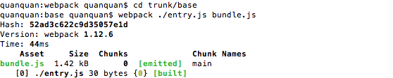
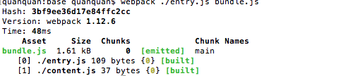

# webpack 工程化

# 1 webpack原生支持js
## 安装WEBPACK 首先要安装node
 `npm install --save-dev webpack -g`
## 添加entry.js文件,添加html页面,页面中引用js,名称为bundle.js

## 在文件夹根目录下执行以下命令
`webpack ./entry.js bundle.js`

## 再添加一个文件content.js,在entry.js中引入该模块
执行命令,webpack会分析你入口文件对于其他文件的依赖，这些文件（通常称为模块）也会被包含在bundle.js中

 
 
# 2 使webpack支持css
 
## 安装loader
 需要**css-loader**来处理css文件，同时我们也需要**style-loader**来应用这些样式,
 运行**npm install --save-dev style-loader css-loader**来安装这些loader（此处使用局部安装而非全局安装），这会在你的目录下生成node_modules文件夹.
 
## 添加style.css,同样在entry.js加入引用
 执行命令 `webpack ./entry.js bundle.js --module-bind 'css=style!css'` ,后面参数表示根据模块类型（扩展名）来自动绑定需要的loader.
 **注：感叹号的作用在于使同一文件能够使用不同类型的loader**
 
# 3 配置文件
将入口 输出文件及路径 模块加载器等可以配置到webpack.config.js文件,之后仅执行 `webpack` 进行编译;
另外,npm可以引导任务执行,在package.json中对npm的脚本部分进行相关设置即可用命令`npm run start`代替, 相当于把npm的start命令指向webpack命令,具体看配置 

# 4 更友好地输出,添加进度显示
`webpack --progress --colors`

# 5 监听模式(热更新)
`webpack --progress --colors --watch`

# 6 生成Source Maps（使调试更容易）
需要配置devtool

|    devtool选项    |    配置结果 |
| :--------------    | --------:|
|    source-map      | 在一个单独的文件中产生一个完整且功能完全的文件。这个文件具有最好的source map，但是它会减慢打包文件的构建速度；|
| cheap-module-source-map     | 在一个单独的文件中生成一个不带列映射的map，不带列映射提高项目构建速度，但是也使得浏览器开发者工具只能对应到具体的行，不能对应到具体的列（符号），会对调试造成不便；|
| eval-source-map      |   使用eval打包源文件模块，在同一个文件中生成干净的完整的source map。这个选项可以在不影响构建速度的前提下生成完整的sourcemap，但是对打包后输出的JS文件的执行具有性能和安全的隐患。不过在开发阶段这是一个非常好的选项，但是在生产阶段一定不要用这个选项； |
| cheap-module-eval-source-map      |    这是在打包文件时最快的生成source map的方法，生成的Source Map 会和打包后的JavaScript文件同行显示，没有列映射，和eval-source-map选项具有相似的缺点； |

# 7 Loaders
通过使用不同的loader，webpack通过调用外部的脚本或工具可以对各种各样的格式的文件进行处理,比如说分析JSON文件并把它转换为JavaScript文件，或者说把下一代的JS文件（ES6，ES7)转换为现代浏览器可以识别的JS文件.
或者说对React的开发而言，合适的Loaders可以把React的JSX文件转换为JS文件。
如 `npm install --save-dev json-loader` 安装json-loader可以读取该JSON文件的值.
## babel
 npm一次性安装多个依赖模块，模块之间用空格隔开
`npm install --save-dev babel-core babel-loader babel-preset-es2015 babel-preset-react`
Babel其实可以完全在webpack.config.js中进行配置，但是考虑到babel具有非常多的配置选项，在单一的webpack.config.js文件中进行配置往往使得这个文件显得太复杂，因此一些开发者支持把babel的配置选项放在一个单独的名为 `.babelrc` 的配置文件中