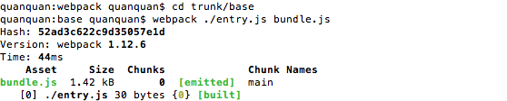
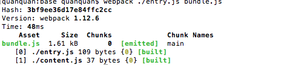

# webpack 工程化

# 1 webpack原生支持js
## 安装WEBPACK 首先要安装node
 `npm install webpack -g`
## 添加entry.js文件,添加html页面,页面中引用js,名称为bundle.js

## 在文件夹根目录下执行以下命令
`webpack ./entry.js bundle.js`

## 再添加一个文件content.js,在entry.js中引入该模块
执行命令,webpack会分析你入口文件对于其他文件的依赖，这些文件（通常称为模块）也会被包含在bundle.js中

 
 
# 2 使webpack支持css
 
## 安装loader
 需要**css-loader**来处理css文件，同时我们也需要**style-loader**来应用这些样式,
 运行**npm install css-loader style-loader**来安装这些loader（此处使用局部安装而非全局安装），这会在你的目录下生成node_modules文件夹.
 
## 添加style.css,同样在entry.js加入引用
 执行命令 `webpack ./entry.js bundle.js --module-bind 'css=style!css'` ,后面参数表示根据模块类型（扩展名）来自动绑定需要的loader
 
# 2 配置文件
将入口 输出文件及路径 模块加载器等可以配置到webpack.config.js文件,之后仅执行 `webpack` 进行编译

# 更友好地输出,添加进度显示
`webpack --progress --colors`

# 监听模式(热更新)
`webpack --progress --colors --watch`